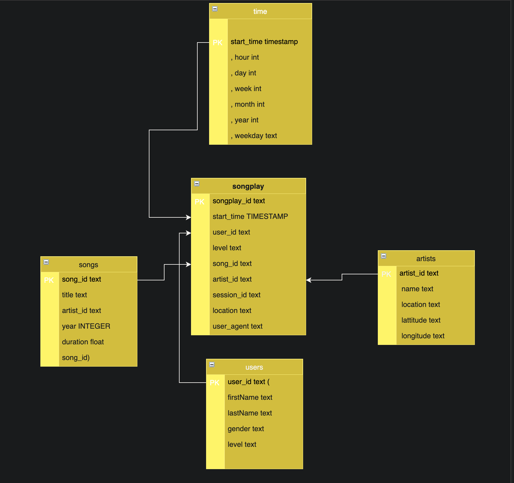

    
<h2>
 Datasets I have used  :
</h2>

* 1- data/song_data
* 2- data/song_data      


<h1></h1>

<h2> Program execution : </h2>

First you should run ```python create_tables.py```  on Termanl tp create the database and tables .
Then run ```python etl.py``` to execute the scrept that responsable for move data from dataset to the database (ETL Process). 
Make shure that to connect to databse using user and passowrd autentcation .


<h1></h1>
<h2> Schema Design :  </h2>

Please fine this digram I have created to descibe the schema .



<h1></h1>


<h2>The Purpose of this database: </h2>
- To simplify analyzing the data those collected on songs and user activity on their new music streaming app .


<h1></h1>

 <h2> Example Queries : </h2>
- To get Number of songs each day : 
 <h6></h6>
 
 ```SELECT date_trunc('day', start_time) days , count(songplay_id) as songs from songplays group by 1 order by 2 desc ; ```


